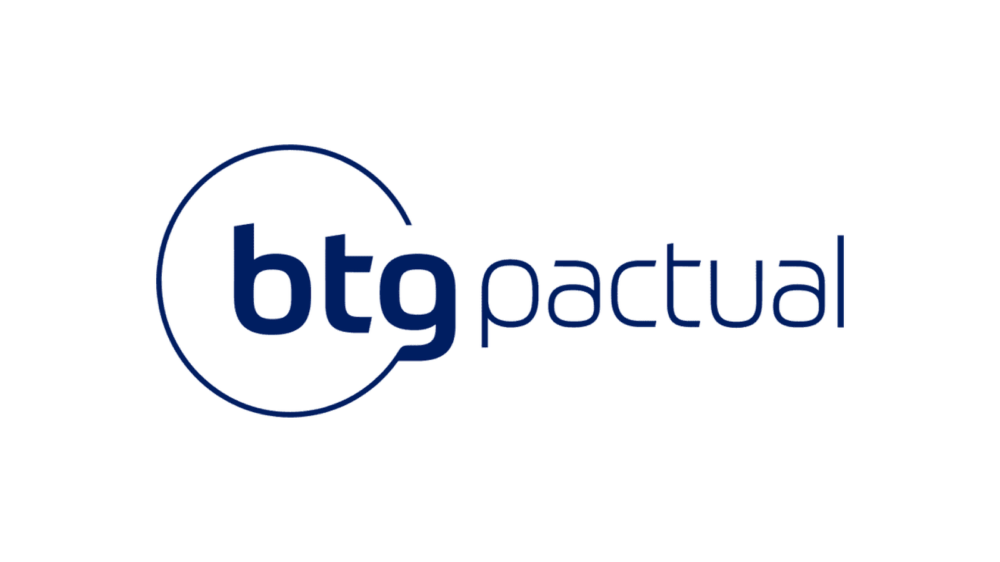

# 🏦 Register User BTG — Vue 3 Dashboard

<p align="center">
  
</p>

<p align="center">
  <strong>Dashboard moderno desenvolvido com Vue 3 + Vite</strong><br />
  Projeto focado em arquitetura limpa, experiência do usuário e boas práticas de frontend.
</p>

---

## ✨ Visão Geral

O **Register User** é uma aplicação frontend construída com **Vue 3**, simulando um ambiente de dashboard profissional inspirado em aplicações financeiras modernas.

O projeto serve como base para:

- Cadastro e visualização de usuários
- Dashboards administrativos
- Integração futura com APIs reais
- Estudos de arquitetura frontend escalável

---

## 🧱 Estrutura do Projeto

```text
register-user/
├── src/
│   ├── assets/          # Assets estáticos
│   ├── components/      # Componentes reutilizáveis
│   ├── views/           # Páginas da aplicação
│   ├── router/          # Vue Router
│   ├── stores/          # Pinia (state management)
│   ├── styles/          # Estilos globais / SCSS
│   └── main.ts          # Bootstrap da aplicação
├── public/
├── index.html
└── vite.config.ts
📦 Tecnologias Utilizadas
Core
Vue 3 (Composition API)

Vite

TypeScript

Gerenciamento de Estado & Rotas
Pinia

Vue Router

UI / UX
SCSS (sass-embedded)

Lucide Icons

Vue ChartJS

Formulários & Validação
Vee-Validate

Yup

HTTP
Axios

🎨 UI / UX
Layout moderno e responsivo

Sidebar dinâmica (desktop e mobile)

Componentização focada em reutilização

Estado global centralizado

Design inspirado em dashboards corporativos

🚀 Scripts Disponíveis
Instalação
bash
Copiar código
npm install
Desenvolvimento
bash
Copiar código
npm run dev
Build de Produção
bash
Copiar código
npm run build
Preview do Build
bash
Copiar código
npm run preview
Type Check
bash
Copiar código
npm run type-check
🧪 Status do Projeto
✅ Estrutura base configurada

✅ Vue 3 + Vite

✅ Pinia + Router

✅ Layout de dashboard

🚧 Integração com API

🚧 Autenticação real

🛠️ Requisitos
Node.js >= 20

npm ou yarn

📄 Licença
Projeto privado para fins educacionais, estudos e demonstração.
```
